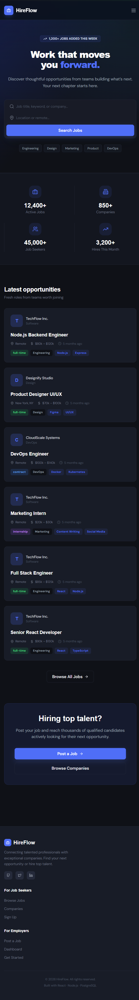

# HireFlow

HireFlow is a polished job board frontend built with React, Vite, Tailwind CSS, and React Query. It connects job seekers with open roles and gives employers a focused workspace for posting jobs and reviewing applicants.

## Preview



## Features

- Search and filter job listings by keyword, category, type, location, and experience
- Browse companies and their open roles
- Job seeker authentication, saved jobs, applications, and profile management
- Employer dashboard, job posting, and applicant management
- Responsive dark navy visual system with accessible focus and loading states

## Run locally

```bash
npm install
npm run dev
```

The frontend expects the API at `http://localhost:5000` during local development. Start the backend separately from the backend repository.

## Build

```bash
npm run build
```
